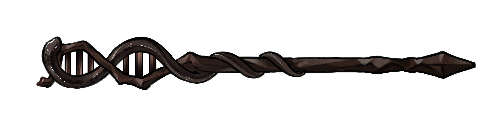

# CASTER Linux walkthrough (Linux版CASTER演示)

[](CASTER.png)

# INSTALLATION (安装)

You can choose to clone ASTER repository from GitHub or Gitee: 
(您可以选择从GitHub或Gitee克隆ASTER代码库)

```
git clone https://github.com/chaoszhang/ASTER
```

or (或)

```
git clone https://gitee.com/chaos_zhang/ASTER
```

Now you can enter ASTER directory and install via `make`.
（现在您可以进入ASTER目录并用`make`指令安装）

```
cd ASTER
make
```

Now we enter the directory for our CASTER demo.
(现在我们可以进入CASTER演示用目录了)

```
cd example/caster
```

# Alignments in FASTA format (比对为FASTA格式)

CASTER can take as input a list of alignments in FASTA format. Yes, sequences must be aligned first. Notice that although in this demo I use genes, CASTER actually prefers inter-genic regions.
(CASTER允许将多个FASTA格式比对文件作为输入。没错，你必须先比对好。注意，虽然这个演示用了基因，但CASTER更适合用基因间区域)

```
ls fasta_alignments/*
cat fasta_alignments/gene1.fa
```

## Prepare the input file (准备输入文件)

Put all input FASTA alignment files in a list:
(将所有输入FASTA格式比对文件放到一个列表文件里) 

```
ls fasta_alignments/* > input_fasta_list.txt
cat input_fasta_list.txt
```

Absolute paths are preferred:
(更推荐用绝对路径)

```
realpath fasta_alignments/* > input_fasta_list.txt
cat input_fasta_list.txt
```

## Run (运行)

Save the output to `caster-site.nw`.
(将输出文件保存到`caster-site.nw`)

```
../../bin/caster-site -i input_fasta_list.txt -o caster-site.nw
cat caster-site.nw
```

Now, let's try using 4 threads.
(试着用四个线程看看)

```
../../bin/caster-site -i input_fasta_list.txt -o caster-site.nw -t 4
cat caster-site.nw
```

You can choose a single species as the outgroup.
（您可选择单个物种作为外群）

```
../../bin/caster-site -i input_fasta_list.txt -o caster-site.nw -t 4 --root Orangutan
cat caster-site.nw
```

Now, try CASTER-pair.
（试试CASTER-pair）

```
../../bin/caster-pair -i input_fasta_list.txt -o caster-pair.nw -t 4 --root Orangutan
cat caster-pair.nw
```

You can also add a guide tree file which may contain one or more guide trees.
（您也能指定一个参考树文件，该文件可以包括一个或多个参考树）

```
../../bin/caster-pair -i input_fasta_list.txt -g caster-site.nw -o caster-pair.nw -t 4 --root Orangutan
cat caster-pair.nw
```

When normal inference is computationally impossible, you can try only using local search around guide trees.
（当计算资源不足，无法用常规方法推断物种树，您可以尝试仅搜索与参考树类似的物种树）

```
../../bin/caster-pair -i input_fasta_list.txt -g caster-site.nw -o caster-pair.nw -t 4 -r 0 -s 0 --root Orangutan
cat caster-pair.nw
```

You can score an existing tree and you must specify the outgroup again, but if you wish, you can switch the outgroup.
（您可限定物种树的拓扑结构，这时您仍需要指定外群，当然如果您愿意，您可以指定不同的外群）

```
../../bin/caster-site -i input_fasta_list.txt -C -c caster-pair.nw -o caster-site.score.nw -t 4 --root Human
cat caster-site.score.nw
```

Scoring an existing tree is useful when computing branch lengths, as `caster-site_branchlength` is much slower than normal `caster-site`.
（由于`caster-site_branchlength`比`caster-site`慢很多，指定物种树的拓扑结构计算枝长可以事半功倍）

```
../../bin/caster-site_branchlength -i input_fasta_list.txt -C -c caster-site.nw -o caster-site_branchlength.nw -t 4 --root Orangutan
cat caster-site_branchlength.nw
```

# Alignments in PHYLIP format (比对为PHYLIP格式)

CASTER can take as input multiple alignments in PHYLIP format. Notice that although in this demo I use genes, CASTER actually prefers inter-genic regions.
(CASTER允许将多个PHYLIP格式比对文件作为输入。注意，虽然这个演示用了基因，但CASTER更适合用基因间区域)

```
ls phylip_alignments/*
cat phylip_alignments/gene1.phy
```

## Prepare the input file (准备输入文件)

Concatenate all input PHYLIP files into one file:
(将所有输入PHYLIP文件合并成一个文件) 

```
cat phylip_alignments/* > concat.phy
cat concat.phy
```

## Run (运行)

Save the output to `caster-site.nw`.
(将输出文件保存到`caster-site.nw`)

```
../../bin/caster-site -i concat.phy -o caster-site.nw
cat caster-site.nw
```

Now let's try using 4 threads.
(试着用四个线程看看)

```
../../bin/caster-site -i concat.phy -o caster-site.nw -t 4
cat caster-site.nw
```

You can choose a single species as the outgroup.
（您可选择单个物种作为外群）

```
../../bin/caster-site -i concat.phy -o caster-site.nw -t 4 --root Orangutan
cat caster-site.nw
```

Other tricks see **Alignments in FASTA format**.
(其他技巧参照**比对为FASTA格式**)

# Sliding window analysis (滑窗分析)
Continue [here](caster-sliding-window-walkthrough.md)