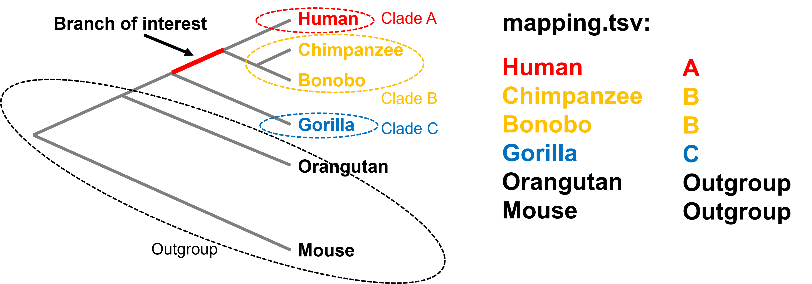
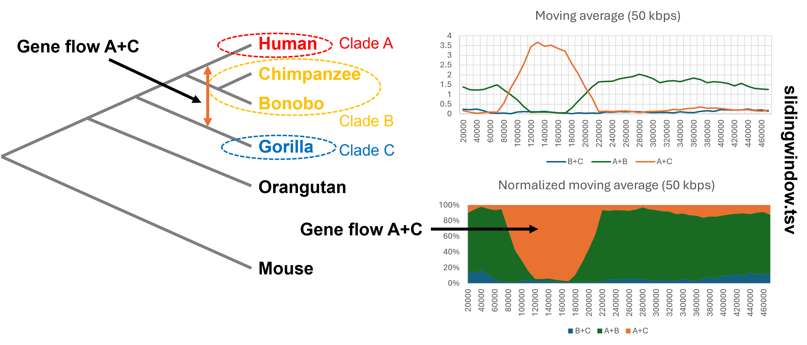

# CASTER sliding window Linux walkthrough

[](CASTER.png)

# Installation

You can choose to clone or download from GitHub: 

```
git clone https://github.com/chaoszhang/MASTERWORK
cd MASTERWORK
git checkout experimental
make
```

or

```
wget https://github.com/chaoszhang/MASTERWORK/archive/refs/heads/experimental.zip
unzip experimental.zip
mv MASTERWORK-experimental MASTERWORK
cd MASTERWORK
make
```

# Performing sliding window analysis

Now we enter the directory for our CASTER sliding window demo.

```
cd YOUR_PATH/ASTER/example/caster-sliding-window
```

To run sliding window program, you need to prepare two files, an alignment in FASTA format and a mapping file representing a branch of interest.

```
cut -c 1-50 ape.fa
cat mapping.tsv
```

The mapping file represents a partition of taxa into four groups corresponding to the branch of interest including three clades and a paraphyletic group of all outgroup species.

[](slidingwindow_mapping.png)

Then you can run sliding window program:

```
YOUR_PATH/MASTERWORK/bin/slidingwindow ape.fa mapping.tsv > slidingwindow.tsv
head slidingwindow.tsv
```

You can also adjust window size (default: 10000):

```
YOUR_PATH/MASTERWORK/bin/slidingwindow ape.fa mapping.tsv 50000
```

# Interpreting the result

[](slidingwindow_result.png)

In `slidingwindow.tsv`, `A+B`, `A+C`, and `B+C` represent the scores of the main and the two alternative topologies.
Notice, those scores can be negative when window size is too small, especially when ILS level is low.

When we only have ILS but no gene flow, then `A+B` is greater than `A+C` and `B+C`, and the later two are approximately equal.

Inequality between `A+C` and `B+C` is a sign of potential gene flow.

See [`slidingwindow.xlsx`](../example/caster-sliding-window/slidingwindow.xlsx) for visualization.