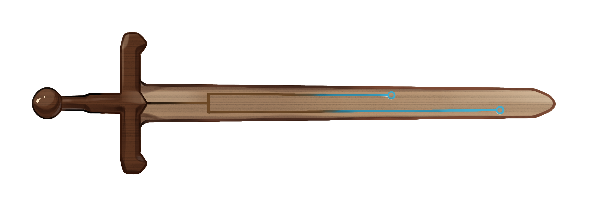

# WASTER Linux walkthrough (Linux版WASTER演示)

[](WASTER.png)

# INSTALLATION (安装)

You can choose to clone ASTER repository from GitHub or Gitee: 
(您可以选择从GitHub或Gitee克隆ASTER代码库)

```
git clone https://github.com/chaoszhang/ASTER
```

or (或)

```
git clone https://gitee.com/chaos_zhang/ASTER
```

Now you can enter ASTER directory and install via `make`.
（现在您可以进入ASTER目录并用`make`指令安装）

```
cd ASTER
make
```

Now we enter the directory for our WASTER demo.
(现在我们可以进入WASTER演示用目录了)

```
cd example/waster-walkthrough
```

# Prepare the input file (准备输入文件)
## Reads in FASTQ format (FASTQ格式的读长文件)

One FASTQ file per sample (每个样本一个FASTQ文件)

```
head -n 4 Human.fq
```

## Assemblies in FASTA format (FASTA格式的组装文件)

One FASTA file per sample (每个样本一个FASTA文件)

```
head -n 2 Chimpanzee.fa
```

## Input file format (输入文件格式)

One sample name per line, each followed by a FASTQ/FASTA file path (每个样本名一行，样本名后面是FASTQ/FASTA文件路径)

```
cat input.tsv
```

# Run (运行)
***Running WASTER requires 64GB memory!*** If you just want to run this walkthrough on your home computer, you can append `-k 7` to each command.

Save the output to `waster.nw`.
(将输出文件保存到`waster.nw`)

```
../../bin/waster -i input.tsv -o waster.nw
cat waster.nw
```

Now, let's try using 4 threads.
(试着用四个线程看看)

```
../../bin/waster -i input.tsv -o waster.nw -t 4
cat waster.nw
```

You can choose a single species as the outgroup.
（您可选择单个物种作为外群）

```
../../bin/waster -i input.tsv -o waster.nw -t 4 --root Orangutan
cat waster.nw
```

Scoring an existing tree is useful when computing branch lengths, as `waster_branchlength` is much slower than normal `waster`.
（由于`waster_branchlength`比`waster`慢很多，指定物种树的拓扑结构计算枝长可以事半功倍）

```
../../bin/waster_branchlength -i input.tsv -C -c waster.nw -o waster_branchlength.nw -t 4 --root Orangutan
cat waster_branchlength.nw
```

Other tricks see [CASTER walkthrough](caster-linux-walkthrough.md).
(其他技巧参照[CASTER演示](caster-linux-walkthrough.md))