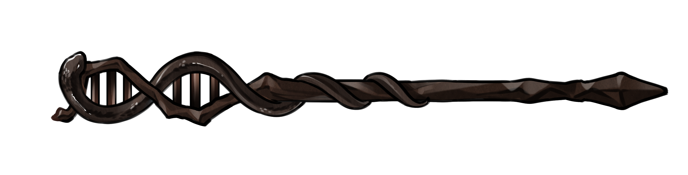

# Coalescence-aware Alignment-based Species Tree EstimatoR (CASTER)

[](../misc/CASTER.png)

Genome-wide data have the promise of dramatically improving phylogenetic inferences. Yet, inferring the true phylogeny remains a challenge, mainly because the evolutionary histories of different genomic regions differ. The traditional concatenation approach ignores such differences, resulting in both theoretical and empirical shortcomings. In response, many discordance-aware inference methods have been developed. Yet, all have their own weaknesses. Many methods rely on short recombination-free genomic segments to build gene trees and thus suffer from a lack of signals for gene tree reconstruction, resulting in poor species tree. Some methods wrongly assume that the rate of evolution is uniform across the species tree. Yet, others lack enough scalability to analyze phylogenomic data.

We introduce a new site-based species tree inference method that seeks to address these challenges without reconstructing gene trees. Our method, called CASTER (Coalescence-aware Alignment-based Species Tree EstimatoR), has two flavors: CASTER-site and CASTER-pair. The first is based on patterns in individual sites and the second is based on pairs of sites.

CASTER has several outstanding features:
1. CASTER introduces two new optimization objectives based on genomic site patterns of four species; we show that optimizing these objectives produces two estimators: CASTER-site is statistically consistent under MSC+HKY model while allowing mutation rate to change across sites and across species tree branches; CASTER-pair is statistically consistent under MSC+GTR model under further assumptions.
2. CASTER comes with a scalable algorithm to optimize the objectives summed over all species quartets. Remarkably, its time complexity is linear to the number of sites and at most quasi-quadratic with respect to the number of species.
3. CASTER can handle multiple samples per species, and CASTER-site specifically can work with allele frequencies of unphased multiploid.
4. CASTER is extremenly memory efficent, requiring <1 byte per SNP per sample

Under extensive simulation of genome-wide data, including recombination, we show that both CASTER-site and CASTER-pair out-perform concatenation using RAxML-ng, as well as discordance-aware methods SVDQuartets and wASTRAL in terms of both accuracy and running time. Noticeably, CASTER-site is 60–150X faster than the alternative methods. It reconstructs an Avian tree of 51 species from aligned genomes with 254 million SNPs in only 3.5 hours on an 8-core desktop machine with 32 GB memory. It can also reconstruct a species tree of 201 species with approximately 2 billion SNPs using a server of 256 GB memory.

Our results suggest that CASTER-site and CASTER-pair can fulfill the need for large-scale phylogenomic inferences.

## Publication

Chao Zhang, Rasmus Nielsen, Siavash Mirarab, CASTER: Direct species tree inference from whole-genome alignments. Science (2025) https://www.science.org/doi/10.1126/science.adk9688

## Notice

Since CASTER-site and CASTER-pair assume different models, please run both and choose the result that makes more sense if you can.


# Announcements

## Integrated in Phylosuite (NEW)

Many ASTER tools have been integrated in [PhyloSuite](http://phylosuite.jushengwu.com/), an integrated and scalable desktop platform for streamlined molecular sequence data management and evolutionary phylogenetics studies.

## GUI for Windows users

Please check out our software with GUI. Simply download the [zip file](https://github.com/chaoszhang/ASTER/archive/refs/heads/Windows.zip), extract the contents, enter `exe` folder, and click `aster-gui.exe`. 

## Bug Reports

Contact ``chao.zhang@sund.ku.dk``, [``aster-users@googlegroups.com``](https://groups.google.com/forum/#!forum/aster-users), or post on [ASTER issues page](https://github.com/chaoszhang/ASTER/issues).

# Documentations
- The rest of this TUTORIAL file
- Forums (feel free to ask questions or ask for help running ASTER):
  - [User group discussions](https://groups.google.com/forum/#!forum/aster-users)
  - [ASTER issues page](https://github.com/chaoszhang/ASTER/issues)
  - QQ group: 130635706

# INSTALLATION
For most users, installing ASTER is ***very*** easy!
Download using one of two approaches:
  - You simply need to download the zip file for [Windows](https://github.com/chaoszhang/ASTER/archive/refs/heads/Windows.zip)/[MacOS](https://github.com/chaoszhang/ASTER/archive/refs/heads/MacOS.zip)/[Linux](https://github.com/chaoszhang/ASTER/archive/refs/heads/Linux.zip) and extract the contents to a folder of your choice.
  - Alternatively, you can clone the [github repository](https://github.com/chaoszhang/ASTER.git) and checkout the branch named Windows/MacOS/Linux.

Binary files should be in the `exe` folder for Windows or `bin` folder otherwise. If you are lucky, these may just work as is and you may not need to build at all.

## For Linux/Unix/WSL users
1. In terminal, `cd` into the downloaded directory and run `make`.
  - If you see `*** Installation complete! ***` then you are done!
  - If you see `Command 'g++' not found` then before rerunning `make`,
    - Debian (Ubuntu) users try
      ```
      sudo apt update
      sudo apt install g++
      ```
    - CentOS (RedHat) users try
      ```
      sudo yum update
      sudo yum install gcc-c++
      ```
    - Unix (MacOS) users should be prompted for installing `g++` and please click "install". If no prompt, try `g++`.
  - If you see "error" when running `make`, please try `make caster-site` instead and file a bug report.
2. Binary files should be in the `bin` folder.

## For Windows users
- [Executables](https://github.com/chaoszhang/ASTER/archive/refs/heads/Windows.zip) for x86-64 are available in `exe` folder and it is **very likely** that they already work.
- [Windows Subsystem for Linux (WSL)](https://docs.microsoft.com/en-us/windows/wsl/install) is HIGHLY recommanded if you need to install on your own! Please follow instructions in "For Linux/Unix/WSL users" section.
- To compile windows excutables:
  1. Download [MinGW](https://sourceforge.net/projects/mingw-w64/) and install ***posix*** version for your architecture (eg. x86-64)
  2. Add path to `bin` folder of MinGW to [system environment variable `PATH`](https://www.google.com/search?q=Edit+the+system+environment+variables+windows)
  3. Double click `make.bat` inside the downloaded directory

### GUI for Windows users (NEW)

Please check out our software with GUI. Simply download the [zip file](https://github.com/chaoszhang/ASTER/archive/refs/heads/Windows.zip), extract the contents, enter `exe` folder, and click `aster-gui.exe`. 

# STOP!
Please make sure you removed paralogous alignment regions using `RepeatMasker` or alike. This will improve the accuracy of CASTER on biological datasets!

A detailed [walkthrough](../misc/caster-linux-walkthrough.md) is also available (English/中文).

A walkthrough for [sliding window](../misc/caster-sliding-window-walkthrough.md) analysis is also available.

# INPUT
* The input by default is a single MSA in Fasta format
* The input can also be a text file containing a list of Fasta files (one file per line) if you add `-f list` to input arguments
* The input can also be a single Phylip files or vertically concatenated Phylip files in one file by adding `-f phylip` to input arguments
* The input files can have missing taxa and multiple individuals/copies per species.
* When individuals/copies/genes from the same species are available, you need to let CASTER to know that they are from the same species. You can do this in two ways.
  1. You can give multiple individuals/copies/genes from the same species the same name in the input alignment.
  2. OR, a mapping file needs to be provided using the `-a` option.
```
individual_A1 species_name_A
individual_A2 species_name_A
individual_B1 species_name_B
individual_B2 species_name_B
individual_B3 species_name_B
...
```
  Or
```
gene_A1 species_name_A
gene_A2 species_name_A
gene_B1 species_name_B
gene_B2 species_name_B
gene_B3 species_name_B
...
```

Examples:

Single Fasta file:
```
>species_A
AAA
>species_C
CCC
>species_G
GGG
>species_T
TTT
```

Single Phylip file, multiple individuals with mapping file:
```
5 3
individual_A1 AAA
individual_A2 AAA
species_C CCC
species_G GGG
species_T TTT
```
Mapping file:
```
individual_A1 species_A
individual_A2 species_A
```

Multiple Fasta file:
```
gene1.fasta
gene2.fasta
```
In `gene1.fasta`:
```
>species_A
AAA
>species_C
CCC
>species_G
GGG
>species_T
TTT
```
In `gene2.fasta` (order can change, fasta files can have missing taxa):
```
>species_C
CC
>species_A
AA
>species_T
TT
```

Multiple Phylip file, multiploid without mapping file (if using `CASTER-pair`, genes must be phased; if using `CASTER-site`, you can arbitrarily phase them):
```
6 3
species_A AAA
species_A AAA
species_A AAA
species_A AAA
species_C CCC
species_C CCC
4 2
species_A AA
species_A AA
species_T TT
species_T TT
```

Notice: only `CASTER-site` works on unphased SNPs, you can translate VCF files into Fasta (or Phylip) in the following way.

VCF:
```
species_A
A/A/C/T
A/A/G/G
```
Fasta (order and phasing do not matter):
```
>species_A
AA
>species_A
AA
>species_A
CG
>species_A
TG
```

# OUTPUT
The output in is Newick format and gives:

* the species tree topology
* branch supports measured as local bootstrap support (>95.0 means good)
* It can also annotate branches with other quantities, such as quartet scores and local bootstraps for all three topologies.

# EXECUTION
ASTER currently has no GUI. You need to run it through the command-line. In a terminal/PowerShell, go to the directory (location) where you have downloaded ASTER and issue the following command:

```
bin/caster-site
```

This will give you a list of options available. If you are using Windows, please replace `bin/caster-site` with `.\exe\caster-site.exe`.

To find the species tree with input from in a file called `INPUT_FILE`, use:

```
bin/caster-site INPUT_FILE
```
or
```
bin/caster-site -i INPUT_FILE
```

In the first case, INPUT_FILE is ***hard-coded*** to be the ***last argument*** for backward compatibility. 

For example if you want to run `caster-site` with input `example/genetrees.tre_1.fas`, then run

```
bin/caster-site example/genetrees.tre_1.fas
```
or
```
bin/caster-site -i example/genetrees.tre_1.fas
```

The results will be outputted to the standard output. To save the results in a file use the `-o OUTPUT_FILE` option before `INPUT_FILE`(**Strongly recommended**):

```
bin/caster-site -o OUTPUT_FILE INPUT_FILE
```
or
```
bin/caster-site -i INPUT_FILE -o OUTPUT_FILE
```

With `-i INPUT_FILE` option, the order does not matter anymore. For brevity, from here on we will not demonstrate `-i INPUT_FILE` cases.

To save the logs (**also recommended**), run:

```
bin/caster-site -o OUTPUT_FILE INPUT_FILE 2>LOG_FILE
```

For example, you can run

```
bin/caster-site -o example/genetrees.tre_1.fas.stree example/genetrees.tre_1.fas 2>example/genetrees.tre_1.fas.log
```

ASTER supports multi-threading. To run program with 4 threads, add `-t 4` before `INPUT_FILE`:

```
bin/caster-site -t 4 -o OUTPUT_FILE INPUT_FILE 2>LOG_FILE
```

ASTER has very good parrallel efficiency up to 64 cores when input data is large. In fact, it often experiences super-linear speedup with 16 cores or more. So feel free to use as many cores as you want.

ASTER also allows rooting at an given outgroup:

```
bin/caster-site --root YOUR_OUTGROUP INPUT_FILE
```

## Advanced Options

ASTER algorithm first performs `R` (4 by default) rounds of search and then repeatedly performs `S` (4 by default) rounds of subsampling and exploration until no improvement found.

```
bin/caster-site -r R -s S -o OUTPUT_FILE INPUT_FILE 2>LOG_FILE
```

If you want to run with more rounds of placement for ensured optimality, then you can run with
```
bin/caster-site -r 16 -s 16 -o OUTPUT_FILE INPUT_FILE 2>LOG_FILE
```
or simply
```
bin/caster-site -R -o OUTPUT_FILE INPUT_FILE 2>LOG_FILE
```

If you want to place taxa on an existing ***fully resolved*** species tree, you can use `-c SPECIES_TREE_IN_NEWICK_FORMAT` before `INPUT_FILE`:

```
bin/caster-site -o OUTPUT_FILE -c SPECIES_TREE_IN_NEWICK_FORMAT INPUT_FILE
```

Specifically, you can score and annotate a ***fully resolved*** species tree containing all taxa with `-c SPECIES_TREE_IN_NEWICK_FORMAT`. If want to score a species tree or you want to place only ***one*** taxon onto the tree, you can use

```
bin/caster-site -r 1 -s 0 -o OUTPUT_FILE -c SPECIES_TREE_IN_NEWICK_FORMAT INPUT_FILE
```
or simply,
```
bin/caster-site -C -o OUTPUT_FILE -c SPECIES_TREE_IN_NEWICK_FORMAT INPUT_FILE
```

If you want to give hints by providing candidate species trees or trees similar to the species tree, you can use `-g SPECIES_TREES_IN_NEWICK_FORMAT` before `INPUT_FILE`:

```
bin/caster-site -o OUTPUT_FILE -g SPECIES_TREES_IN_NEWICK_FORMAT INPUT_FILE
```
